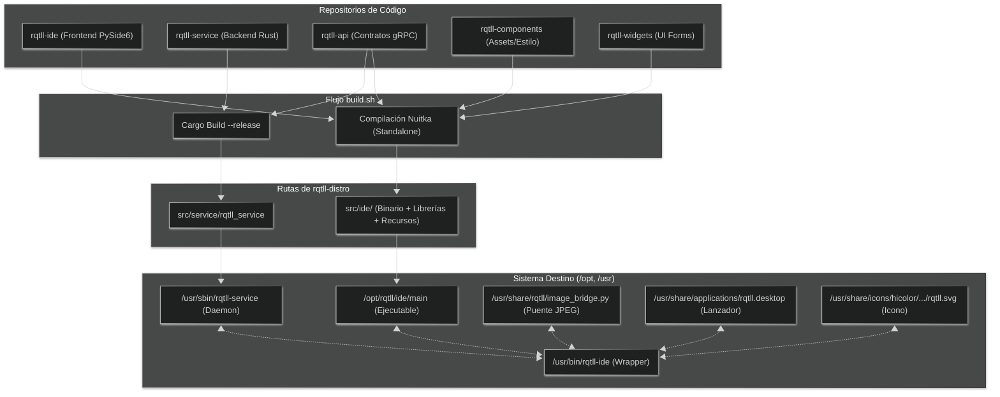

# rqtll-distro

<picture>
  <source media="(prefers-color-scheme: dark)" srcset="https://github.com/RQTLL/rqtll-components/blob/main/assets/branding/logo-main-light.svg">
  <source media="(prefers-color-scheme: light)" srcset="https://github.com/RQTLL/rqtll-components/blob/main/assets/branding/logo-main-dark.svg">
  
</picture>

Repositorio de metadatos de distribución y empaquetado para el ecosistema RQTLL. Centraliza el flujo de construcción automatizada, dependencias de sistema e instalación para RQTLL (`rqtll-ide` y `rqtll-service`).

---

## Table of Contents
- [rqtll-distro](#rqtll-distro)
  - [Table of Contents](#table-of-contents)
  - [Ecosistema y Flujo de Trabajo](#ecosistema-y-flujo-de-trabajo)
  - [Construcción y Empaque (build.sh)](#construcción-y-empaque-buildsh)
    - [Requisitos de Compilación](#requisitos-de-compilación)
    - [Ejecución](#ejecución)
  - [Instalación del Ecosistema (install.sh)](#instalación-del-ecosistema-installsh)
    - [Instalación Rápida (One-Liner Remoto)](#instalación-rápida-one-liner-remoto)
    - [Instalación Local](#instalación-local)
    - [Detalles de Integración en el Escritorio](#detalles-de-integración-en-el-escritorio)
  - [Estructura del Repositorio](#estructura-del-repositorio)
  - [Cómo contribuir](#cómo-contribuir)
  - [Seguridad](#seguridad)
  - [Licencia](#licencia)
  - [Mantenedores](#mantenedores)

---

## Ecosistema y Flujo de Trabajo

`rqtll-distro` agrupa y distribuye los entregables de desarrollo del ecosistema RQTLL:



---

## Construcción y Empaque (build.sh)

El script [build.sh](build.sh) se encarga de preparar todo el ecosistema RQTLL de forma automática.

### Requisitos de Compilación
El script se ejecuta en distribuciones basadas en **Ubuntu/Debian** y requiere conexión a Internet la primera vez para resolver dependencias. Instala automáticamente si faltan:
- Herramientas esenciales (`curl`, `build-essential`, `patchelf`)
- Rust y Cargo (via `rustup`)
- Python 3 y Pip con paquetes: `pyside6`, `grpcio-tools`, `protobuf`, `nuitka`

### Ejecución
Para clonar todo el espacio de trabajo que falta y construir los binarios de producción:
```bash
./build.sh
```
El script:
1. Verifica si existen las carpetas de los repositorios paralelos del ecosistema. Si falta alguna, la clona recursivamente desde los repositorios de GitHub.
2. Instala dependencias y herramientas de compilación que falten en el sistema.
3. Compila el servicio de Rust (`rqtll-service`) en modo optimizado `release`.
4. Compila la interfaz de Python (`rqtll-ide`) a C++ autónomo usando **Nuitka**, empaqueta sus librerías compartidas (`.so`) y copia los directorios dinámicos de recursos (`external/`).
5. Genera la estructura final en el directorio `src/`.

---

## Instalación del Ecosistema (install.sh)

El instalador [install.sh](install.sh) configura RQTLL de forma integrada en el sistema operativo.

### Instalación Rápida (One-Liner Remoto)
Si eres un usuario final y no tienes clonado el proyecto, puedes instalar todo ejecutando directamente:
```bash
sudo sh -c "$(curl -fsSL https://raw.githubusercontent.com/RQTLL/rqtll-distro/main/install.sh)"
```
*Nota: Si se ejecuta vía curl, el instalador clonará temporalmente los binarios precompilados de `rqtll-distro` y limpiará el sistema al finalizar.*

### Instalación Local
Si ya has compilado el proyecto localmente mediante `./build.sh`, puedes instalarlo con:
```bash
sudo ./install.sh
```

### Detalles de Integración en el Escritorio
El instalador configura:
1. **Lanzador en `/usr/bin/rqtll-ide`**: Un script envoltura que comprueba si el daemon `rqtll-service` está activo; si no lo está, lo arranca de forma transparente en segundo plano y posteriormente lanza la IDE.
2. **Icono oficial del sistema**: Copia el logotipo en formato SVG y ejecuta `gtk-update-icon-cache` para evitar fallos de renderizado.
3. **Acceso directo en el Escritorio y Menú**: Registra un archivo `.desktop` y le asocia la directiva `StartupWMClass=rqtll-ide`. Esto vincula de forma perfecta la ventana en ejecución con el icono oficial en la barra de tareas o el dock.

---

## Estructura del Repositorio

- `src/ide/`: Contiene el binario compilado `main` y todas las librerías dinámicas (`.so`) empaquetadas por Nuitka para arrancar de forma standalone, junto con la carpeta `external/` de recursos.
- `src/service/`: Contiene el binario del backend (`rqtll_service`) y su puente de optimización de imágenes (`image_bridge.py`).
- `build.sh`: Script automatizado para la verificación, clonación, instalación de herramientas y compilación del entorno.
- `install.sh`: Script instalador para configurar binarios, wrappers, iconos y lanzadores de escritorio.

---

## Cómo contribuir

- Lee [CONTRIBUTING.md](CONTRIBUTING.md) antes de enviar un Pull Request.
- Para proponer actualizaciones en recetas de empaquetado o configuraciones de instalación, abre un issue detallando los cambios de dependencias del sistema operativo.
- Las contribuciones deben pasar las validaciones de construcción del paquete de distribución local antes de ser integradas.

---

## Seguridad

Consulta [SECURITY.md](SECURITY.md) para conocer el procedimiento de reporte de vulnerabilidades.

---

## Licencia

Este proyecto está bajo la licencia **MIT**. Consulta el archivo [LICENSE](LICENSE) para más detalles.

---

## Mantenedores

* **adnKSharp** <adnksharp@gmail.com>
