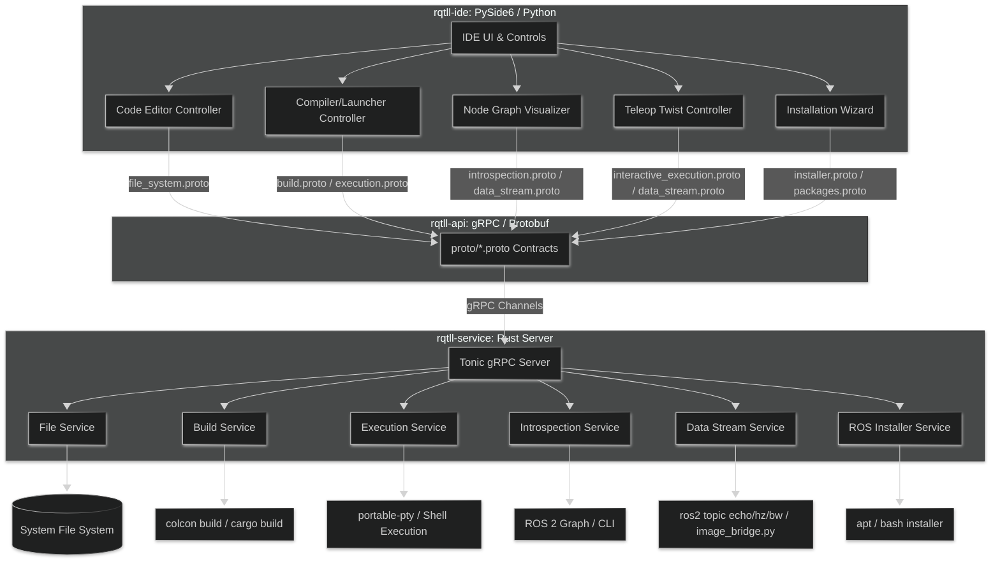

# rqtll-api

<picture>
  <source media="(prefers-color-scheme: dark)" srcset="https://github.com/RQTLL/rqtll-components/blob/main/assets/branding/logo-main-light.svg">
  <source media="(prefers-color-scheme: light)" srcset="https://github.com/RQTLL/rqtll-components/blob/main/assets/branding/logo-main-dark.svg">
  
</picture>

API gRPC/Protobuf que define los contratos de comunicación e interfaces de servicios entre la interfaz gráfica (`rqtll-ide`) y el motor de ejecución en segundo plano (`rqtll-service`).

> [!CAUTION]
> Este es un repositorio núcleo. Cualquier cambio en la paleta o iconos se propagará a todos los módulos que lo consumen.

## Table of Contents
- [rqtll-api](#rqtll-api)
  - [Table of Contents](#table-of-contents)
  - [Quickstart](#quickstart)
    - [Requirements](#requirements)
    - [Consumir rqtll-api](#consumir-rqtll-api)
      - [1. Como Dependencia Git en Rust (`Cargo.toml`)](#1-como-dependencia-git-en-rust-cargotoml)
      - [2. Como Submódulo de Git](#2-como-submódulo-de-git)
    - [Compilar y Generar Stubs](#compilar-y-generar-stubs)
      - [En Rust](#en-rust)
      - [En Python](#en-python)
  - [Arquitectura de Comunicación](#arquitectura-de-comunicación)
  - [Estructura del Repositorio](#estructura-del-repositorio)
  - [Cómo contribuir](#cómo-contribuir)
  - [Security](#security)
  - [License](#license)
  - [Maintainers](#maintainers)

## Quickstart

Este repositorio contiene los archivos de definición Protocol Buffers v3 (`.proto`) y los scripts necesarios para compilar y generar stubs tanto para Python como para Rust.

### Requirements

- `Rust` (stable, 1.70+ recomendado)
- `protoc` (Protocol Buffers Compiler)
- `Python 3` con las librerías `grpcio-tools` y `protobuf` instaladas

### Consumir rqtll-api

#### 1. Como Dependencia Git en Rust (`Cargo.toml`)
```toml
rqtll_api = { git = "https://github.com/RQTLL/rqtll-api.git", rev = "<commit-sha>" }
```

#### 2. Como Submódulo de Git
```bash
# Dentro del directorio del proyecto que va a consumir rqtll-api
git submodule add https://github.com/RQTLL/rqtll-api.git external/rqtll-api
git submodule update --init --recursive
```

En el `Cargo.toml` de tu proyecto de Rust, añade la siguiente línea:
```toml
rqtll_api = { path = "external/rqtll-api" }
```

### Compilar y Generar Stubs

#### En Rust
El proceso se gestiona automáticamente mediante `build.rs` al compilar el proyecto:
```bash
cargo build
```

#### En Python
Ejecuta el script bash para compilar las interfaces y guardarlas en el directorio `py/`:
```bash
bash ./py.sh
```

---

## Arquitectura de Comunicación

El siguiente diagrama detalla cómo interactúan los controladores del Frontend con los servicios del Backend a través de los contratos gRPC de `rqtll-api`:



---

## Estructura del Repositorio

```text
./
├── proto/                               # Contratos de servicios gRPC (.proto)
│   ├── file_system.proto                # Gestión y lectura/escritura de archivos
│   ├── interactive_execution.proto      # Sesiones interactivas sobre terminal PTY
│   ├── settings.proto                   # Configuración persistente del sistema
│   ├── system_utils.proto               # Estadísticas del sistema y bibliotecas
│   ├── packages.proto                   # Gestión de instalación/remoción de paquetes
│   ├── types.proto                      # Tipos de mensajes comunes y estructuras vacías
│   ├── workspace.proto                  # Administración de directorios de workspaces
│   ├── terminal.proto                   # Virtualización de PTY/Consolas
│   ├── installer.proto                  # Control del asistente de instalación de ROS 2
│   ├── data_stream.proto                # Canales de métricas y streams de ROS 2
│   ├── clone_ws.proto                   # Clonación asíncrona de espacios de trabajo
│   ├── introspection.proto              # Listado e introspección de tópicos y nodos
│   ├── execution.proto                  # Lanzamiento no-interactivo de nodos
│   └── build.proto                      # Recetas de compilación y limpieza de colcon
├── py/                                  # Directorio de salida de stubs para Python
├── src/                                 # Módulos de carga en Rust para Tonic
├── build.rs                             # Script de compilación de Tonic para Rust
├── py.sh                                # Script de compilación de protoc para Python
├── Cargo.toml                           # Configuración del Crate de Rust
└── README.md
```

## Cómo contribuir

- Lee [CONTRIBUTING.md](CONTRIBUTING.md) antes de enviar un Pull Request.
- Para añadir o modificar una llamada de servicio, edita el archivo `.proto` correspondiente en `proto/`.
- Mantén la retrocompatibilidad: no reutilices ni alteres los índices de campo existentes; utiliza `reserved` para campos en desuso.
- Ejecuta `cargo build` y `./py.sh` para comprobar que los cambios compilan de manera correcta para ambos lenguajes.

## Security

Consulta [SECURITY.md](SECURITY.md) para conocer el procedimiento de reporte de vulnerabilidades.

## License

Este proyecto está bajo la licencia **MIT**. Consulta el archivo [LICENSE](LICENSE) para más detalles.

## Maintainers

* **adnKSharp** <adnksharp@gmail.com>
